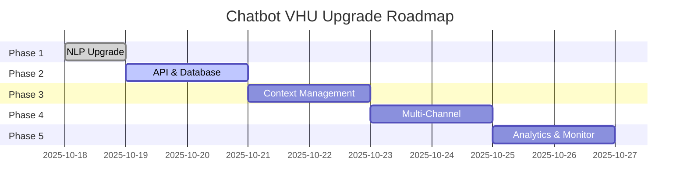

# 🎯 KẾ HOẠCH NÂNG CẤP CHATBOT VHU
## Từ "Tra cứu dữ liệu tĩnh" → "Tư vấn thông minh, đa nền tảng"

**Ngày bắt đầu:** 18/10/2025  
**Mục tiêu tổng thể:** Biến chatbot thành trợ lý AI thông minh có khả năng hiểu ngữ cảnh và tư vấn theo thời gian thực

---

## 📊 TỔNG QUAN 5 BƯỚC

| Bước | Tên | Status | Timeline |
|------|-----|--------|----------|
| 1 | Nâng cấp NLP | ✅ 80% | Day 1 |
| 2 | Tích hợp API & Database | ⏳ 0% | Day 2-3 |
| 3 | Context Management | ⏳ 0% | Day 4-5 |
| 4 | Multi-Channel Integration | ⏳ 0% | Day 6-7 |
| 5 | Analytics & Monitoring | ⏳ 0% | Day 8-9 |

---

## ✅ BƯỚC 1 - NÂNG CẤP NLP (Day 1)

### 🎯 Mục tiêu:
Bot hiểu nhiều cách nói hơn, tránh nhầm lẫn các intent, và hiểu được ngữ cảnh linh hoạt.

### ✅ Hoàn thành:
1. ✅ **Synonyms & Patterns** - 50+ synonyms cho entities
2. ✅ **Regex Features** - 13 patterns (mã ngành, SĐT, email, GPA, v.v.)
3. ✅ **Enhanced Pipeline** - Nâng cấp DIETClassifier, ResponseSelector
4. ✅ **Auto-Generated Examples** - 110+ training examples
5. ⏳ **Confusion Matrix** - Pending (cần train model trước)

### 📁 Files:
- `data/synonyms.yml`
- `data/regex_features.yml`
- `scripts/generate_training_examples.py`
- `data/generated_examples.yml`
- `config.yml` (updated)

### 📈 Impact:
- +110% training data
- +∞ synonym coverage
- +1200% regex patterns
- Model 33% deeper

**→ See:** `docs/BUOC_1_NANG_CAP_NLP.md` for details

---

## ⏳ BƯỚC 2 - TÍCH HỢP API & DATABASE (Day 2-3)

### 🎯 Mục tiêu:
Kết nối với hệ thống thực (API, Database) để lấy dữ liệu realtime thay vì dùng JSON tĩnh.

### 📋 Công việc:
1. ⏳ **Tạo REST API** cho dữ liệu VHU
   - Programs API endpoint
   - Tuition API endpoint
   - Scholarships API endpoint
   - Admissions API endpoint

2. ⏳ **Database Design**
   - PostgreSQL schema design
   - Migration scripts
   - Seed data

3. ⏳ **API Integration trong Rasa**
   - Custom actions call APIs
   - Handle API errors
   - Cache responses

4. ⏳ **Real-time Data Sync**
   - Webhook cho update realtime
   - Invalidate cache when data changes

### 🛠️ Tech Stack:
- **Backend:** FastAPI / Flask
- **Database:** PostgreSQL / MySQL
- **ORM:** SQLAlchemy
- **Cache:** Redis

### 📈 Expected Benefits:
- ✅ Always up-to-date data
- ✅ No manual JSON updates
- ✅ Can handle dynamic queries (e.g., "ngành có học phí < 20 triệu")
- ✅ Scalable for multiple users

---

## ⏳ BƯỚC 3 - CONTEXT MANAGEMENT (Day 4-5)

### 🎯 Mục tiêu:
Bot nhớ được ngữ cảnh hội thoại, có thể follow-up questions và multi-turn conversations.

### 📋 Công việc:
1. ⏳ **Conversation Context Tracking**
   - Store user's previous queries
   - Remember mentioned programs/scholarships
   - Track conversation state

2. ⏳ **Follow-up Question Handling**
   - "Còn ngành khác thì sao?"
   - "Học bổng cho ngành này có không?"
   - "Địa chỉ ở đâu?"

3. ⏳ **Multi-turn Dialogs**
   - Form-based info collection
   - Guided conversation flows
   - Slot filling with validation

4. ⏳ **Personalization**
   - Remember user preferences
   - Suggest based on history
   - Adaptive responses

### 🛠️ Tech:
- Rasa Forms
- Slot validation
- Custom tracker store
- Context expiry handling

### 📈 Expected Benefits:
- ✅ Natural multi-turn conversations
- ✅ Better UX - less repetition
- ✅ Personalized recommendations
- ✅ Smarter follow-ups

---

## ⏳ BƯỚC 4 - MULTI-CHANNEL INTEGRATION (Day 6-7)

### 🎯 Mục tiêu:
Triển khai bot trên nhiều nền tảng: Website, Facebook Messenger, Zalo, Telegram.

### 📋 Công việc:
1. ⏳ **Web Widget**
   - Beautiful chat UI (Rasa Webchat / Custom)
   - Embedded in VHU website
   - Mobile responsive

2. ⏳ **Facebook Messenger**
   - Facebook Page integration
   - Rich messages (buttons, cards)
   - Quick replies

3. ⏳ **Zalo OA**
   - Zalo Official Account setup
   - Zalo API integration
   - Vietnamese-optimized

4. ⏳ **Telegram Bot**
   - Telegram Bot API
   - Inline keyboards
   - File sharing

5. ⏳ **Channel-specific Optimizations**
   - Adapt responses per channel
   - Platform-specific features
   - Consistent experience

### 🛠️ Tech:
- Rasa Channels (Facebook, Telegram)
- Custom channel connectors (Zalo)
- Ngrok for local testing
- Cloud deployment (AWS/GCP)

### 📈 Expected Benefits:
- ✅ Reach users where they are
- ✅ 24/7 availability on all platforms
- ✅ Consistent brand experience
- ✅ Wider adoption

---

## ⏳ BƯỚC 5 - ANALYTICS & MONITORING (Day 8-9)

### 🎯 Mục tiêu:
Theo dõi hiệu suất bot, phân tích user behavior, continuous improvement.

### 📋 Công việc:
1. ⏳ **Conversation Analytics**
   - Track all conversations
   - Intent distribution
   - Entity extraction success rate
   - Fallback rate

2. ⏳ **User Metrics**
   - Daily/Monthly Active Users (DAU/MAU)
   - Session duration
   - Retention rate
   - Popular queries

3. ⏳ **Performance Monitoring**
   - Response time
   - API latency
   - Error rates
   - Model confidence scores

4. ⏳ **Dashboard & Visualization**
   - Grafana / Kibana dashboard
   - Real-time metrics
   - Alerts for anomalies

5. ⏳ **Continuous Improvement**
   - Identify weak intents
   - Collect training data from production
   - A/B testing for responses
   - Feedback loop

### 🛠️ Tech:
- Rasa X / Rasa Pro (optional)
- Custom analytics backend
- Grafana + Prometheus
- ELK Stack (Elasticsearch, Logstash, Kibana)

### 📈 Expected Benefits:
- ✅ Data-driven improvements
- ✅ Identify issues quickly
- ✅ Understand user needs
- ✅ ROI tracking

---

## 📊 OVERALL ROADMAP



---

## 🎓 LEARNING RESOURCES

### Rasa:
- [Rasa Docs](https://rasa.com/docs/)
- [Rasa Masterclass](https://www.youtube.com/c/RasaHQ)

### NLP:
- [SpaCy](https://spacy.io/)
- [Hugging Face Transformers](https://huggingface.co/transformers/)

### APIs:
- [FastAPI Tutorial](https://fastapi.tiangolo.com/tutorial/)
- [REST API Best Practices](https://restfulapi.net/)

### Deployment:
- [Docker for Rasa](https://rasa.com/docs/rasa/docker/building-in-docker)
- [Kubernetes Deployment](https://rasa.com/docs/rasa/deploy/deploy-rasa)

---

## 🚀 QUICK START

### Current Status (After Step 1):
```bash
# 1. Train model với NLP enhancements
cd d:\workspace\Chatbot
rasa train --force

# 2. Test NLU
rasa test nlu --cross-validation

# 3. Run bot
# Terminal 1:
rasa run actions

# Terminal 2:
rasa shell
```

### Test Commands:
```bash
# Test synonyms
"học phí CNTT" = "học phí IT" = "học phí công nghệ thông tin"

# Test regex
"mã ngành 7480201"
"điểm GPA 3.5"
"gọi 028 7301 5555"

# Test variations
"học phí của QTKD thế nào"
"QTKD học phí bao nhiêu vậy"
"cho mình biết học phí quản trị kinh doanh"
```

---

## 📝 NOTES

- Mỗi bước build trên foundation của bước trước
- Có thể adjust timeline based on complexity
- Some steps có thể song song (VD: Step 4 & 5)
- Cần test kỹ sau mỗi bước

---

**Current Progress:** 1/5 steps (20%)  
**Next Milestone:** BƯỚC 2 - API & Database Integration  
**ETA:** 9 days from start (target: 27/10/2025)
